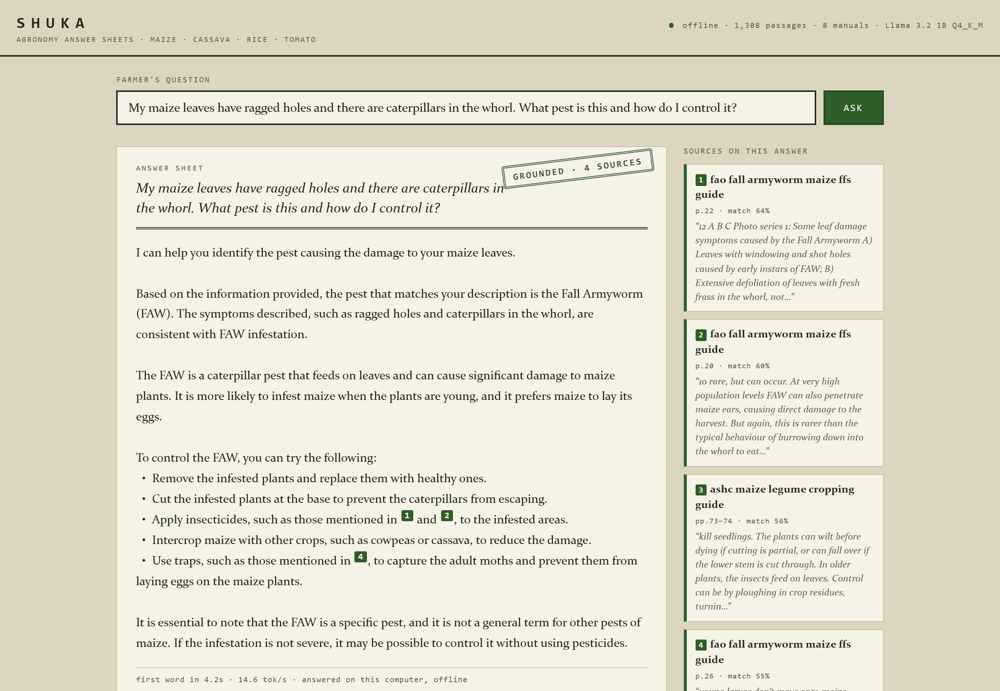

# Shuka — offline agronomy assistant

**Website: [uthmannabeel.github.io/shuka](https://uthmannabeel.github.io/shuka/)**

**Africa Deep Tech Challenge 2026 · Agriculture track.** *Shuka* is Hausa
for "to plant / to sow."

Nigeria's agricultural extension system is stretched to roughly one
extension worker per several thousand farmers, and the obvious fallback —
asking an AI assistant — fails exactly where farming happens: rural areas
with weak or unaffordable connectivity, on low-end hardware. Shuka is an
agronomy assistant that runs **entirely offline** on the hardware
cooperatives and agro-dealers actually own (the ADTC Standard Laptop: 8GB
RAM, integrated graphics, i5-class CPU). One offline laptop at a
cooperative serves a whole community.

Small language models make fluent, confident, and **dangerously wrong**
agronomists — our baseline runs had a bare 1B model recommending growing
cassava from seed and inventing fertiliser arithmetic. Shuka's answer is
architectural, not cosmetic: the model supplies *language*, a curated
corpus of real extension literature supplies the *facts*.

```
question → on-device embedding (MiniLM, 384d, quantized ONNX)
         → exact cosine search over indexed extension literature
             (FAO / IITA / CABI-ASHC / IRRI — ~850 pages, license-verified)
         → top-4 passages + question → Llama 3.2 1B Instruct Q4_K_M (llama.cpp)
         → answer constrained to sources, with page-level citations
```

**Guardrail:** if no passage clears a similarity floor, the model is not
called at all — Shuka says it doesn't have sources and points the farmer to
their local extension office. Silence beats confident error when the cost
of being wrong is somebody's growing season.

## Quickstart

```bash
npm install
bash download_model.sh   # fetches the GGUF into model/ (~0.8 GB)
npm run setup            # caches the embedding model; verifies the GGUF
npm run serve            # web app at http://localhost:4180
```

After `npm run setup`, no network is used at all.



The web app presents each answer as a **manual-style answer sheet**: the
text cites its sources like a printed extension bulletin, the margin shows
each cited document with page numbers and a match score, and every sheet is
stamped — `GROUNDED · N SOURCES`, or `NOT IN SOURCES` in red when the
corpus doesn't cover the question and Shuka declines to guess. Set
`SHUKA_HOST=0.0.0.0` to let phones on the cooperative's own Wi-Fi/hotspot
use the laptop as an offline answer server.

There is also a CLI:

```bash
npm run ask -- "How do I control fall armyworm in maize?"
npm run ask -- --show-context "..."   # print retrieved passages + scores
npm run ask -- --raw "..."            # bare model, no retrieval (comparison only)
```

## Repository layout

| Path | What it is |
|---|---|
| `src/server.js` + `web/` | local web app — answer sheets with cited sources (`npm run serve`) |
| `src/ask.js` | CLI entry — retrieval-grounded Q&A with citations |
| `src/lib/` | embedder, chunker, retriever, prompt policy, llama.cpp wrapper |
| `src/ingest.js` | corpus PDFs → chunks → embeddings → `corpus/index.json` |
| `src/bench.js` | throughput / TTFT / peak-RSS benchmark (`npm run bench`) |
| `src/eval.js` | raw-vs-grounded accuracy eval harness (`npm run eval`) |
| `corpus/index.json` | the built retrieval index (committed; the app's knowledge) |
| `corpus/SOURCES.md` | every corpus document, its origin, and its verified license |
| `eval/` | question set, grading rubric, and graded results |
| `bench-results/` | benchmark records, including the July QVAC baseline |
| `metadata.json`, `download_model.sh`, `REPORT.md` | ADTC submission contract |

The source PDFs are not redistributed here (several carry non-commercial
licenses); `corpus/SOURCES.md` lists the exact URL and license for each,
and `npm run ingest` rebuilds the index from `corpus/raw/`.

## Benchmarks

See `REPORT.md` for current numbers and `bench-results/` for raw records.
Metrics are features here: tokens/sec, time-to-first-token, and peak
process-tree RSS are measured, not estimated, and the report separates
prefill from decode because RAG prompts are long by design.

## License

Code: MIT (see `LICENSE`). Corpus documents remain under their original
licenses, per `corpus/SOURCES.md`. Model weights: Llama 3.2 Community
License (fetched, not redistributed). Open-source dependencies:
node-llama-cpp (llama.cpp), @huggingface/transformers, pdf-parse.
